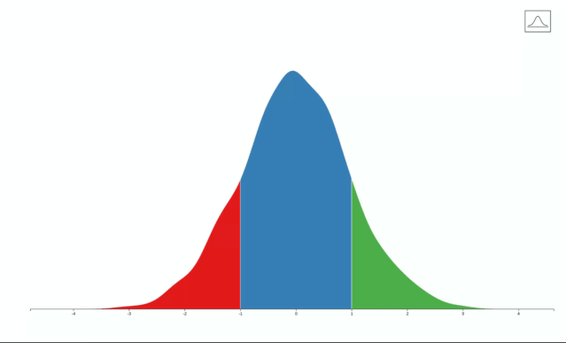

<!-- README.md is generated from README.Rmd. Please edit that file -->
IMPosterior
===========

The goal of IMposterior is to ...

Example
-------

This is a basic example which shows you how to solve a common problem:

``` r
library(IMposterior)
set.seed(9782)
x <- rnorm(1000)
IMposterior(x= x, MME=1)
```



Notes
=====

The bell-curve icon was [created by Davo Sime.](https://thenounproject.com/term/bell-curve/614251/)
